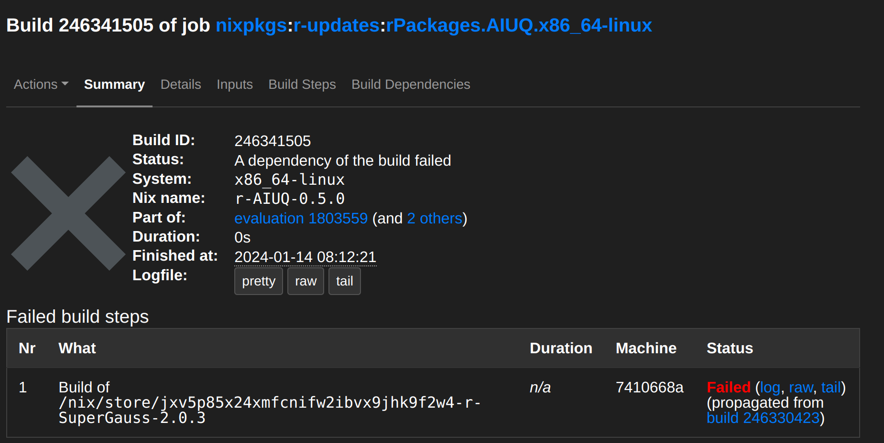
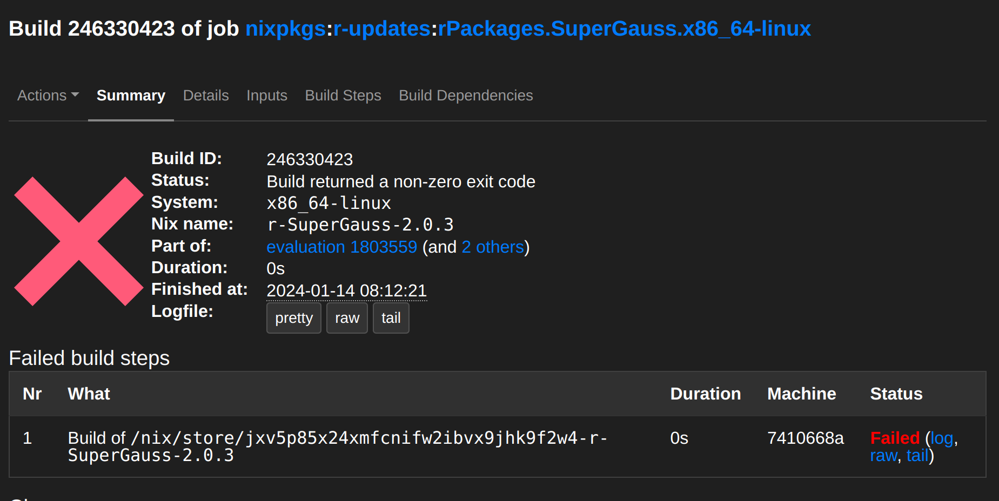

# Contributing to nixpkgs as an R programmer: a cookbook

## Introduction

So you've discovered Nix, and started using it for your day-to-day work, and now
you would like to help package CRAN and Bioconductor packages for `nixpkgs`, but
don't know where to start?

This guide will help you help us! It lists N common recipes to start fixing R
packages for inclusion to `nixpkgs`. Every package available on CRAN and
Bioconductor gets built on Hydra and made available through the `rPackages`
packageset. So there's no need to manually package them. However, some packages
don't build successfully, and require manual fixing. Most of them are very
quick, one-line fixes, but others require a bit more work. The goal of this
cookbook is to make you quickly familiar with the main reasons a package may be
broken and explain to you how to fix it, and why certain packages get fixed in
certain ways.

## *Mise en place*

We first need to get our tools and ingredients in order before cooking. Fork the
[`nixpkgs` repository](https://github.com/NixOS/nixpkgs) and clone it to your
computer. Then, add the original repository as a remote:

```
git checkout master

# Add upstream as a remote
git remote add upstream git@github.com:NixOS/nixpkgs.git
```

This way, each time you want to fix a package, you can fetch the latest updates
from upstream and merge them to your local copy:

```
# Fetch latest updates
git fetch upstream

# Merge latest upstream/master to your master
git merge upstream/master
```

Make sure to merge the latest commits from upstream regularly, because `nixpkgs`
gets updated very frequently each day. We can now look for a package to fix.

## The starter: where to find packages to fix

The first step to help fix a package is to find a package to fix: you should
visit the latest `rPackages` evaluation over
[here](https://hydra.nixos.org/jobset/nixpkgs/r-updates). Click on the "Still
failing jobs" tab to see which packages' builds didn't succeed and click on a
package. You should see something like this:



From there, you can see that `{AIUQ}`'s build failed because of another package,
`{SuperGauss}`, so fixing `{SuperGauss}` will likely fix this one as well.

From here, you can look for `{SuperGauss}` in the "Still failing jobs" tab, and
see why `{SuperGauss}` failed, or you could check out a little dashboard I built
that you can find
[here](https://raw.githack.com/b-rodrigues/nixpkgs-r-updates-fails/targets-runs/output/r-updates-fails.html).
This dashboard shows essentially the same information you find on the "Still
failing jobs" tab from before, but with several added niceties. First of all,
there's a column called `fails_because_of` that shows the name of the package
that caused another to fail. So in our example with `{AIUQ}`, `{SuperGauss}`
would be listed there (if a package fails for another reason, like a missing
system-level dependency, then its own name is listed there). You can type
`{SuperGauss}` on the little box there to filter and see all the packages that
fail because of of it. Then, you can also see the package's *package rank*. This
rank is computed using the `{packageRank}` package, and the table is sorted by
lowest rank (low ranks indicate high popularity and there's also the
`percentile` column that indicates the percentage of packages with higher
downloads). Finally, there's a direct link to a PR fixing the package (if it has
been opened) and also the PR's status: has it been merged already or not?

Having a link to the PR is quite useful, because it immediately tells you if
someone already tried fixing it. If the PR has been merged, simply try to another
fix package. If the PR is open and not yet merged, this is a great
opportunity to help review it (more on that below)!

Let's go back to fixing `{SuperGauss}`. If you go back on Hydra, you can see the
error message that was thrown during building:



Click on the logfile (either `pretty`, `raw` or `tail`) to see what happened.
Here's what we see:

```
checking for pkg-config... no
checking for FFTW... configure: error: in `/build/SuperGauss':
configure: error: The pkg-config script could not be found or is too old.  Make sure it
is in your PATH or set the PKG_CONFIG environment variable to the full
path to pkg-config.

Alternatively, you may set the environment variables FFTW_CFLAGS
and FFTW_LIBS to avoid the need to call pkg-config.
See the pkg-config man page for more details.

To get pkg-config, see <http://pkg-config.freedesktop.org/>.
See `config.log' for more details
ERROR: configuration failed for package 'SuperGauss'
* removing '/nix/store/jxv5p85x24xmfcnifw2ibvx9jhk9f2w4-r-SuperGauss-2.0.3/library/SuperGauss'
```

So the issue is that some system-level dependencies are missing, `pkg-config`
and `FFTW`, so we need to add these to fix the build. Which brings us the
first recipe of this cookbook!

## Recipe 1: packages that need dependencies to build

Fixing packages that require system-level dependencies is a matter of adding
one, maybe two lines, in the right place in the expression that defines the
whole of the `rPackages` set. You can find this file
[here](https://github.com/NixOS/nixpkgs/blob/master/pkgs/development/r-modules/default.nix).

In there, you will find a line that starts with `packagesWithNativeBuildInputs =
{` and another that starts with `packagesWithBuildInputs = {` which define a
long list of packages. The difference between `NativeBuildInputs` and
`BuildInputs` is that dependencies that are needed for compilation get listed
into `NativeBuildInputs` (so things like compilers and packages such as
`pkg-config`) and dependencies that are needed at run-time (dynamic libraries)
get listed under `BuildInputs`. For R, actually, you could put everything under
`NativeBuildInputs` and it would still work, but we try to pay attention to this
and do it properly. In case of doubt, put everything under `NativeBuildInputs`:
when reviewing your PR, people will then tell you where to put what.

Now try to build the package. The following line will drop you in an interactive
Nix shell with the package if build succeeds (run the command at the root of
the cloned `nixpkgs` directory):

```
nix-shell -I nixpkgs=. -p R rPackages.SuperGauss
```

if you see the same error as on Hydra, and made sure that no PR is opened, then
you can start fixing the package.

So, we need to add two dependencies. Let's read the relevant lines in the error
message again:

```
configure: error: The pkg-config script could not be found or is too old.  Make sure it
is in your PATH or set the PKG_CONFIG environment variable to the full
path to pkg-config.

Alternatively, you may set the environment variables FFTW_CFLAGS
and FFTW_LIBS to avoid the need to call pkg-config.
See the pkg-config man page for more details.
```

If you look in the `default.nix` file, in particular the two lists that define
the packages that need `nativeBuildInputs` and `buildInputs`, you'll see that
many of them have `pkg-config` listed there already. So let's add the following
line in the `packagesWithNativeBuildInputs`

```
SuperGauss = [ pkgs.pkg-config ];
```

and this one under `packagesWithBuildInputs`:

```
SuperGauss = [ pkgs.fftw.dev ];
```

This is because `pkg-config` is only needed to compile `{SuperGauss}` and
`fftw.dev` is needed at run-time as well.

Try to build a shell with `{SuperGauss}` again:

```
nix-shell -I nixpkgs=. -p R rPackages.SuperGauss
```

If it worked, start R and load the library. Sometimes packages can build
successfully but fail to launch, so taking the time to load them avoids wasting
your reviewer's time. Ideally, try to run one or several examples from the
package's vignette or help files. This also makes sure that everything is
working properly. If your testing succeeded, you can now open a PR!

Before committing, make sure that you are on a seprate branch for this fix (you
can do your changes on `master` as long as you don't commit and change branch):

```
git checkout -b fix_supergauss
```

From there, make sure that only the `default.nix` file changed:

```
git status
```

```
user@computer:~/Documents/nixpkgs(fix_supergauss *)$ git status
On branch fix_supergaus
Changes not staged for commit:
  (use "git add <file>..." to update what will be committed)
  (use "git restore <file>..." to discard changes in working directory)
	modified:   pkgs/development/r-modules/default.nix

no changes added to commit (use "git add" and/or "git commit -a")
```

Sometimes, running examples may produce files, so if that's the case get rid of
them. No files added in this case so add `default.nix` to the commit and write
following commit message:

```
git add .
git commit -m "rPackages.SuperGauss: fixed build"
```

This commit message follows `nixpkgs`'s [contributing guidelines](https://nixos.wiki/wiki/Nixpkgs/Contributing).
Format all your messages like this.

Now push your changes:

```
git push origin fix_supergauss
```

and go on your fork's repository to open a PR. 

Congratulations, you fixed your first package!

## Recipe 2: packages that need a home, X, or simple patching

Some package may require a `/home` directory during their installation process. They
usually fail with a message that looks like this:

```
Warning in normalizePath("~") :
  path[1]="/homeless-shelter": No such file or directory
```

so add the package to the list named `packagesRequiringHome` and
try rebuilding.

See this PR as an example: https://github.com/NixOS/nixpkgs/pull/292336

Some packages require `X`, as in `X11`, the windowing system on Linux
distributions. In other words, these pacakges must be installed on a machine
with a graphical session running. So because that's not the case on Hydra, this
needs to be mocked. Simply add the package to the list named
`packagesRequiringX` and try rebuilding.

See this PR https://github.com/NixOS/nixpkgs/pull/292347 for an example.

Finally, some packages that must be compiled need first to be configured. This
is a common step when compiling software. This configuration step ensures that
needed dependencies are found (among other things). Because Nix works the way it
does, it can happen that this configuration step fails because dependencies are
not in the usual `/usr/bin` or `/bin`, etc, paths. So this needs to be patched
before the configuration step. To fix this, the `configuration` file that lists
the different dependencies to be found needs to be patched, and this can be done
by overriding one of the phases before the configure phase. We override the
`postPatch` phase like this:

```
RcppCGAL = old.RcppCGAL.overrideAttrs (attrs: {
  postPatch = "patchShebangs configure";
});
```

Read more about `patchShebangs`
[here](https://github.com/NixOS/nixpkgs/blob/master/pkgs/build-support/setup-hooks/patch-shebangs.sh).

See this PR for an example: https://github.com/NixOS/nixpkgs/pull/289775

Sometimes patching is a bit more complicated. See this other example
[here](https://github.com/NixOS/nixpkgs/pull/291258).

## Recipe 3: packages that require their attributes to be overridden

Staying on the topic of overrides, it can also happen that packages need one or
more of their attributes to be overridden. This is already much more complex
than the recipes from before, because the error messages that may hint at which
attributes to override can be much more cryptic. For example, here's the build
log of `{xslt}`:

```
Running phase: unpackPhase
unpacking source archive /nix/store/gxcysc8y3x1wz7qz3q1fpv8g8f92iqyv-xslt_1.4.4.tar.gz
source root is xslt
setting SOURCE_DATE_EPOCH to timestamp 1676995202 of file xslt/MD5
Running phase: patchPhase
Running phase: updateAutotoolsGnuConfigScriptsPhase
Running phase: configurePhase
Running phase: buildPhase
Running phase: checkPhase
Running phase: installPhase
* installing *source* package 'xslt' ...
** package 'xslt' successfully unpacked and MD5 sums checked
** using staged installation
Found pkg-config cflags and libs!
Using PKG_CFLAGS=-I/nix/store/8jkj0gm1chw8rhpqbpljydlwsm6hmgwp-libxslt-1.1.39-dev/include -I/nix/store/iqjsxkcdnvvz1bfpq960ygicc5clz9hv-libxml2-2.12.3-unstable-2023-12-14-dev/include/libxml2
Using PKG_LIBS=-L/nix/store/ksp5m4p5fi1d8zvhng96qqzy1wqc51v6-libxslt-1.1.39/lib -L/nix/store/4jvs7wz2jfmc6x9zgngfcr9804x9hwln-libxml2-2.12.3-unstable-2023-12-14/lib -lexslt -lxslt -lxml2
** libs
using C++ compiler: 'g++ (GCC) 13.2.0'
rm -f RcppExports.o xslt.o xslt_init.o xslt.so
/nix/store/xq8920m5mbd83vdlydwli7qsh67gfm5v-gcc-wrapper-13.2.0/bin/c++ -std=gnu++17 -I"/nix/store/403kbh5v910gks340j7s1647kijm60rv-R-4.3.2/lib/R/include" -DNDEBUG -I/nix/store/8jkj0gm1chw8rhpqbpljydlwsm6hmgwp-libxslt-1.1.39-dev/include -I/nix/store/iqjsxkcdnvvz1bfpq960ygicc5clz9hv-libxml2-2.12.3-unstable-2023-12-14-dev/include/libxml2 -DSTRICT_R_HEADERS -I'/nix/store/0vzi341m7nbxhdbi8kj50nwn7rrssk5z-r-Rcpp-1.0.12/library/Rcpp/include' -I'/nix/store/h6z1v3qb2pxhb3yjrykdaircz3xk1jla-r-xml2-1.3.6/library/xml2/include'     -fpic  -g -O2  -c RcppExports.cpp -o RcppExports.o
/nix/store/xq8920m5mbd83vdlydwli7qsh67gfm5v-gcc-wrapper-13.2.0/bin/c++ -std=gnu++17 -I"/nix/store/403kbh5v910gks340j7s1647kijm60rv-R-4.3.2/lib/R/include" -DNDEBUG -I/nix/store/8jkj0gm1chw8rhpqbpljydlwsm6hmgwp-libxslt-1.1.39-dev/include -I/nix/store/iqjsxkcdnvvz1bfpq960ygicc5clz9hv-libxml2-2.12.3-unstable-2023-12-14-dev/include/libxml2 -DSTRICT_R_HEADERS -I'/nix/store/0vzi341m7nbxhdbi8kj50nwn7rrssk5z-r-Rcpp-1.0.12/library/Rcpp/include' -I'/nix/store/h6z1v3qb2pxhb3yjrykdaircz3xk1jla-r-xml2-1.3.6/library/xml2/include'     -fpic  -g -O2  -c xslt.cpp -o xslt.o
/nix/store/xq8920m5mbd83vdlydwli7qsh67gfm5v-gcc-wrapper-13.2.0/bin/c++ -std=gnu++17 -I"/nix/store/403kbh5v910gks340j7s1647kijm60rv-R-4.3.2/lib/R/include" -DNDEBUG -I/nix/store/8jkj0gm1chw8rhpqbpljydlwsm6hmgwp-libxslt-1.1.39-dev/include -I/nix/store/iqjsxkcdnvvz1bfpq960ygicc5clz9hv-libxml2-2.12.3-unstable-2023-12-14-dev/include/libxml2 -DSTRICT_R_HEADERS -I'/nix/store/0vzi341m7nbxhdbi8kj50nwn7rrssk5z-r-Rcpp-1.0.12/library/Rcpp/include' -I'/nix/store/h6z1v3qb2pxhb3yjrykdaircz3xk1jla-r-xml2-1.3.6/library/xml2/include'     -fpic  -g -O2  -c xslt_init.cpp -o xslt_init.o
xslt_init.cpp: In function 'void R_init_xslt(DllInfo*)':
xslt_init.cpp:36:37: error: invalid conversion from 'void (*)(void*, xmlError*)' {aka 'void (*)(void*, _xmlError*)'} to 'xmlStructuredErrorFunc' {aka 'void (*)(void*, const _xmlError*)'} [8;;https://gcc.gnu.org/onlinedocs/gcc/Warning-Options.html#index-fpermissive-fpermissive8;;]
   36 |     xmlSetStructuredErrorFunc(NULL, handleError);
      |                                     ^~~~~~~~~~~
      |                                     |
      |                                     void (*)(void*, xmlError*) {aka void (*)(void*, _xmlError*)}
In file included from xslt_init.cpp:4:
/nix/store/iqjsxkcdnvvz1bfpq960ygicc5clz9hv-libxml2-2.12.3-unstable-2023-12-14-dev/include/libxml2/libxml/xmlerror.h:898:57: note:   initializing argument 2 of 'void xmlSetStructuredErrorFunc(void*, xmlStructuredErrorFunc)'
  898 |                                  xmlStructuredErrorFunc handler);
      |                                  ~~~~~~~~~~~~~~~~~~~~~~~^~~~~~~
make: *** [/nix/store/403kbh5v910gks340j7s1647kijm60rv-R-4.3.2/lib/R/etc/Makeconf:200: xslt_init.o] Error 1
ERROR: compilation failed for package 'xslt'
* removing '/nix/store/1p4qp17ccjvi53g3vl67j3z8n1lp61m3-r-xslt-1.4.4/library/xslt'
```

The only hint in there is that url pointing to `gcc`'s manual entry on the
`-fpermissive` flag. What happened is that code raises some warning during
compilation: without this flag, the warning gets turned into an error. So we
need to add this flag during compilation to "tolerate" the warning. Here's how
this was done for `{xslt}`:

```
xslt = old.xslt.overrideAttrs (attrs: {
  env = (attrs.env or { }) // {
    NIX_CFLAGS_COMPILE = attrs.env.NIX_CFLAGS_COMPILE + " -fpermissive";
  };
});
```

So the attribute we override is the `NIX_CFLAGS_COMPILE` attribute. We
add `-fpermissive` to the other flags and we're good to go.

Check out this PR for the complete `{xlst} example: `https://github.com/NixOS/nixpkgs/pull/292329

Also take some time to read other examples of overrides in the `default.nix`
file to learn about other common attributes that could need to be overridden.

## Recipe 4: packages that need a dependency that must be overridden

Sometimes it is not the attribute of a package that needs to be overriden, but
one of its dependencies.

https://github.com/NixOS/nixpkgs/pull/293081

https://github.com/NixOS/nixpkgs/pull/291004

https://github.com/NixOS/nixpkgs/pull/292149

## Solving conflicts

## Broken packages